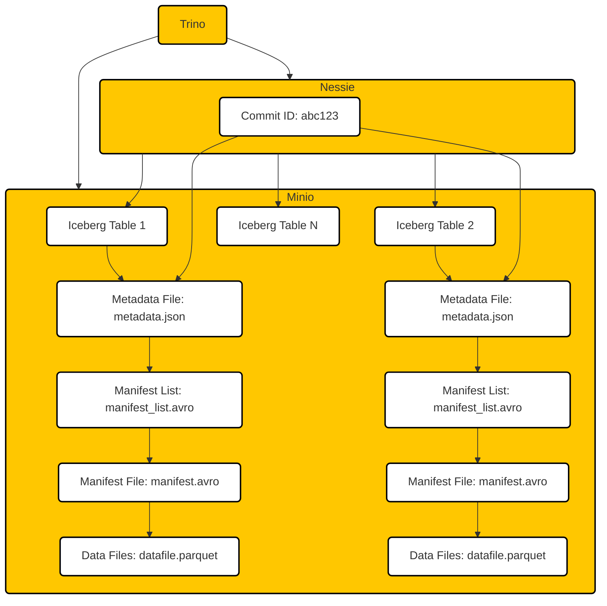

# Building a Poor Man's Datalake: 🦩 + 🦕 + 🐰 + 🧊 = 🚀

Let's build our own Snowflake-like Data Lake using:
- **Minio** - A high-performance, AWS S3 compliant object storage. It will store the data files and manifests for the Iceberg tables.
- **Nessie** - A metadata catalog service that provides a unified and consistent view of the metadata for your data lake. It will keep track of the Iceberg tables and their versions. We will use RocksDB as the matadata catalog storage layer.
- **Trino** - A distributed SQL query engine that can query large datasets stored in various formats across different storage systems. Trino will access both Minio for the table data and Nessie for the metadata to execute SQL queries.
- **Apache Iceberg** - A high-performance table format for huge analytic datasets. Iceberg brings the reliability and simplicity of SQL tables to big data, while making it possible for engines like Trino to perform optimally. Iceberg tables will be stored in Minio and tracked by Nessie.

## Contents
1. [Level 1: Basic Datalake Setup](LEVEL_1.md) - Start here. Deploying a basic Trino-Nessie-Minio-Iceberg setup using docker.
2. [Appendix A: Query Lifecycle](APPENDIX_Query_Lifecycle.md) - a brief description of an SQL Query Lifecycle.
3. [Appendix B: Metadata Tables and Columns](APPENDIX_Metadata_Tables_And_Columns.md) - a primer on metadata exposed as tables and columns.
4. [Appendix C: Time Travel SQL Queries](APPENDIX_Time_Travel_Queries.md) - a primer on time travel Queries.

## High Level Architecture Design

### Disclaimers:

1. The code snippets in these guides include dummy usernames and passwords. I strongly recommend against using them in your deployments.
2. I'm not a DevOps engineer. The Docker Compose file works for me, but it could most likely be improved.
3. I use an ARM-based MacBook, and the code was tested using that particular setup.